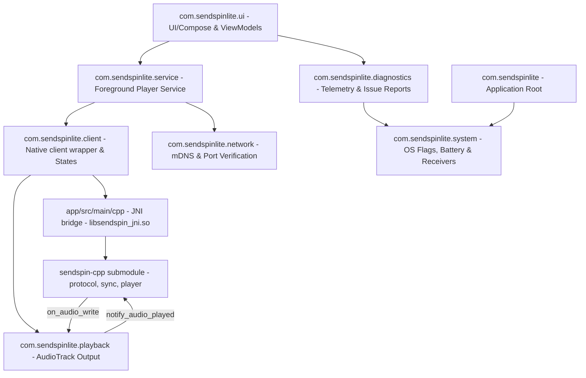

# SendSpin Android Player - Architecture & Developer Documentation

Welcome to the official developer and architecture documentation for the **SendSpin PCM Player Android Application**. 

This document provides a deep, granular look into the system's design, the mathematics governing our time-synchronization engine, the audio playout scheduler pipeline, and practical guidelines for developers working on the codebase.

---

## 🏛️ 1. Architecture & Package Structure

The application is structured around a highly decoupled, modular **Component-Module Package Architecture** under the `com.sendspinlite` namespace. As of the native-client migration, the protocol, time synchronization and audio scheduling are owned by the [sendspin-cpp](https://github.com/Sendspin/sendspin-cpp) library (a git submodule) reached through a thin JNI bridge. Kotlin retains the Android shell: foreground service, mDNS discovery, Compose UI, `AudioTrack` output and diagnostics. See [docs/NATIVE_CLIENT.md](docs/NATIVE_CLIENT.md) for the native integration details.

### Architectural Package Map



### Component Directory Layout

- **`com.sendspinlite` (Root)**:
  - `SendspinApplication.kt`: Application entry-point; configures dependency baselines and triggers background crash reporting services.
- **`com.sendspinlite.ui`**:
  - `MainActivity.kt`: Contains Compose layout screens (volume controls, server state charts, network telemetries, log dumps).
  - `PlayerViewModel.kt`: Intermediates between the frontend UI and the background foreground service.
- **`com.sendspinlite.service`**:
  - `SendspinService.kt`: Run as an Android foreground service with a persistent status notification to ensure the OS does not terminate active audio playout when the app is in the background. Wires native high-performance requests to the WiFi lock.
- **`com.sendspinlite.client`**:
  - `SendspinNativeClient.kt`: Kotlin wrapper around the native client; owns the `AudioTrack` output, exposes the diagnostics/events surface the service consumes, and feeds playback progress back to the native sync task.
  - `SendspinNative.kt`: Thin JNI loader exposing the native lifecycle (`nativeCreate`/`nativeStart`/`nativeConnect`/...) plus the `SendspinNativeCallbacks` interface invoked from native threads.
  - `ClientState.kt`: Decoupled dataclasses representing UI telemetry diagnostics (`ClientDiagnostics`) and outbound server events (`ClientEvent`).
- **`app/src/main/cpp`** (native JNI bridge, built via CMake/NDK into `libsendspin_jni.so`):
  - `jni_onload.cpp`: Captures the `JavaVM` and attaches/detaches native threads to the JVM.
  - `sendspin_client_handle.{h,cpp}`: Owns the `SendspinClient`, player + metadata roles, listeners and the main-loop thread; defines the JNI entry points.
  - `android_player_listener.cpp` / `android_metadata_listener.cpp` / `android_client_listener.cpp` / `android_network_provider.cpp`: Forward sendspin-cpp callbacks to Kotlin.
- **`com.sendspinlite.playback`**:
  - `PcmAudioOutput.kt`: Low-level wrapper of Android's `AudioTrack` class. Implements the `on_audio_write` contract (`writePcm(ByteBuffer, …)`) and reports presented frames via `getPlaybackProgress()`.
  - `PcmFormatSupport.kt`: Probes which PCM sample-rate/channel/bit-depth combinations the device supports.
  - `PlaybackDiagnostics.kt`: Constants representing active playout recovery states.
  - `SendspinAudioWarmup.kt`: Silent PCM format warmup checks used to estimate baseline device pipeline delay.
- **`com.sendspinlite.network`**:
  - `ServiceDiscovery.kt`: Leverages Android's Network Service Discovery (NSD) to resolve `_sendspin-server._tcp.local` servers via mDNS.
  - `PortChecker.kt`: Fast background socket verification tool used to verify server availability before connecting.
- **`com.sendspinlite.diagnostics`**:
  - `AudioIssueReporter.kt`: Gathers system telemetries and bundles anonymized playout logs for Sentry diagnostic dumps.
  - `CrashReportingManager.kt` / `ReportingUtils.kt`: Local files used to store unhandled application crash events.
- **`com.sendspinlite.system`**:
  - `SendspinSystemUtils.kt`: Gathers connection interfaces (Ethernet vs WiFi), device memories, and system media stream volumes.
  - `BootReceiver.kt`: Re-registers foreground services upon system reboot.

---

## ⚡ 2. Audio Synchronization Engine

The primary design constraint of the Sendspin protocol is maintaining **microsecond-level timing sync** across multiple physical client devices playing the same audio stream.

> **Native ownership.** Since the native-client migration, the WebSocket protocol, NTP-style clock synchronization (Kalman filter), audio decoding and playout scheduling are implemented inside [sendspin-cpp](https://github.com/Sendspin/sendspin-cpp), not in Kotlin. The sections below describe the algorithm the native sync task runs. The Android side only delivers decoded PCM to `AudioTrack` and reports playback progress back to the native sync task. See [docs/NATIVE_CLIENT.md](docs/NATIVE_CLIENT.md).

```
       [WebSocket Frame — IXWebSocket, inside sendspin-cpp]
               │
               ▼
   [sendspin-cpp protocol + audio ring buffer]
      • Parse messages, extract server timestamps
      • Decode PCM, schedule against the synchronized clock
               │
               ▼  (native sync task thread)
   [JNI on_audio_write] ──► [PcmAudioOutput → AudioTrack]
               ▲                        │
               │                        ▼ getPlaybackProgress()
   [notify_audio_played] ◄── frames presented + finish timestamp
```

### 1. Clock Synchronization Math (Kalman Filtering)

To translate server-clock timelines into local system times, sendspin-cpp's time filter utilizes a NTP-style 4-timestamp exchange fed into a two-dimensional Kalman filter tracking **clock offset** and **drift**.

#### A. NTP Offset and Delay Calculations
Each sync transaction exchanges four timestamps:
- $T_1$: Client transmitted request time.
- $T_2$: Server received request time.
- $T_3$: Server transmitted response time.
- $T_4$: Client received response time.

$$\text{NTP Offset (Measurement)} = \frac{(T_1 - T_2) + (T_4 - T_3)}{2}$$

$$\text{Max Error (Half RTT)} = \frac{(T_4 - T_1) - (T_3 - T_2)}{2}$$

#### B. The State Vector
The Kalman filter tracks the state vector $x_k = \begin{bmatrix} \theta_k & \delta_k \end{bmatrix}^T$ where:
- $\theta_k$: Monotonic clock offset (Server Time - Client Time) in microseconds.
- $\delta_k$: Monotonic clock drift (rate of change of offset, dimensionless in $\mu s/\mu s$).

#### C. The Prediction Phase
At step $k$ with elapsed microsecond time $dt = t_k - t_{k-1}$:

$$\hat{x}_{k|k-1} = F x_{k-1|k-1} \implies \begin{bmatrix} \hat{\theta}_k \\ \hat{\delta}_k \end{bmatrix} = \begin{bmatrix} 1 & dt \\ 0 & 1 \end{bmatrix} \begin{bmatrix} \theta_{k-1} \\ \delta_{k-1} \end{bmatrix}$$

$$P_{k|k-1} = F P_{k-1|k-1} F^T + Q$$

where $P$ is the $2 \times 2$ covariance matrix, and $Q$ is the process noise covariance matrix updated proportionally to process variance $\sigma_w^2$ and drift variance $\sigma_d^2$:

$$Q = \begin{bmatrix} dt \cdot \sigma_w^2 & 0 \\ 0 & dt \cdot \sigma_d^2 \end{bmatrix}$$

#### D. The Correction Phase
Using NTP offset $z_k$ as measurement and measurement variance $R_k$ derived from delay max-error:

$$\text{Residual (Innovation)} = y_k = z_k - H \hat{x}_{k|k-1} \implies y_k = z_k - \hat{\theta}_k$$

$$\text{Uncertainty Covariance} = S_k = H P_{k|k-1} H^T + R_k \implies S_k = P_{\theta\theta} + R_k$$

$$\text{Kalman Gain} = K_k = P_{k|k-1} H^T S_k^{-1} \implies K_k = \frac{1}{S_k} \begin{bmatrix} P_{\theta\theta} \\ P_{\theta\delta} \end{bmatrix}$$

$$\text{Updated State} = x_{k|k} = \hat{x}_{k|k-1} + K_k y_k$$

$$\text{Updated Covariance} = P_{k|k} = (I - K_k H) P_{k|k-1}$$

#### E. Adaptive Forgetting
If the residual $|y_k|$ exceeds $3 \times \text{max\_error}$ due to network congestion or GC pause:
- Multiply $P$ covariance by a `forgetFactor` to let the filter quickly discard outdated predictions and converge on new network conditions.

---

### 2. Playout Loop & Jitter Scheduling

Inside sendspin-cpp, the native sync task continuously pulls decoded frames from the audio ring buffer and calculates the exact local playback target time. Unlike the previous Kotlin implementation it does not nudge the `AudioTrack` sample rate; it inserts or drops silence to hold sync.

#### Playout Offset Calculation
To align speakers, the scheduler must compensate for three factors:
- **Playout Offset**: Baseline delay ($\approx -50\text{ms}$) to account for Android's internal audio pipeline latency.
- **Playout Offset Adjustment**: Per-device user-defined adjustment ($\pm 100\text{ms}$) to align mismatched hardware.
- **Static Delay** ($static\_delay\_ms$): Spec-defined parameter compensating for external speaker/amplifier latency.

$$\text{Total Playout Offset } (\mu s) = \text{PlayoutOffset} + \text{PlayoutOffsetAdjustment} - \text{StaticDelay}$$

$$\text{Client Target Time } (T_{play}) = \text{convertServerToClient}(T_{server\_timestamp}) + \text{Total Playout Offset}$$

#### Lateness Evaluation
The scheduler computes the early playout offset $E$:

$$E = T_{play} - t_{now}$$

- If $E > \text{AudioTrack Latency}$: The thread delays (sleeps) for the difference to ensure precise playout timing.
- If $E < \text{AudioTrack Latency}$: The frame is considered late. If $E$ falls beyond the late drop threshold, the frame is discarded to catch up to the live stream timeline.

---

### 3. Proportional Speed Adjustment Math (historical)

> The Kotlin client previously corrected drift by nudging the `AudioTrack` sample rate. This is **no longer used**: sendspin-cpp holds sync with silence insert/drop instead, so `PlaybackSpeedController` and the `playbackSpeedMultiplier` diagnostic were removed. The description below is retained for historical context.

To correct tiny drifting errors without audible audio cuts, the former `PlaybackSpeedController` dynamically modified the native sample rate of Android's `AudioTrack`.

1. **Calculate Smoothed Buffer Ahead**: Uses a short window Exponential Moving Average (EMA) to estimate current buffer-ahead depth $B_{ms}$.
2. **Compute Error**: Target buffer depth is $80\text{ms}$. The error is:

$$e_k = B_{ms} - \text{TargetBufferDepth}$$

3. **Sample Rate Scaler**: The sample rate adjustment coefficient is proportionally governed by:

$$\text{Adjustment} = e_k \times K_p$$

- If $e_k > 0$ (buffer is growing): Speed up playout slightly ($\max +1.5\%$).
- If $e_k < 0$ (buffer is shrinking): Slow down playout slightly ($\min -1.5\%$).
- **Deadband**: If $|e_k| < 5\text{ms}$, speed remains at a nominal $1.0\times$ to avoid constant jitter adjustments.

---

## 📡 3. Communication Protocol Flow

```
[Client]                                                          [Server]
   │                                                                 │
   ├─────── client/hello (Supported roles: player@v1) ──────────────>│
   │                                                                 │
   │<────── server/hello (Active roles: player@v1, metadata) ────────┤
   │                                                                 │
   │   ┌────────────────────────────────────────────────────────┐    │
   │   │ Start continuous Clock Sync & Watchdog Loop            │    │
   │   └────────────────────────────────────────────────────────┘    │
   │                                                                 │
   ├─────── client/state (synchronized, player: delay/vol) ─────────>│
   │                                                                 │
   │   ┌─── LOOP: Sync Timings ─────────────────────────────────┐    │
   ├───│─── client/time (client_transmitted) ──────────────────>│    │
   │   │                                                        │    │
   │   │<── server/time (T1, T2, T3) ───────────────────────────│────┤
   │   └────────────────────────────────────────────────────────┘    │
   │                                                                 │
   │<────── stream/start (PCM codec details, sample rate, play_at) ──┤
   │                                                                 │
   │<────── Binary Chunk Type 4 (Audio data payload) ───────────────┤
   │                                                                 │
   │<────── server/state (Group metadata, volume, muted) ───────────┤
   │                                                                 │
   ├─────── client/goodbye (reason: shutdown / another_server) ─────>│
```

---

## 🛠️ 4. Developer's Guide & Verification

### 1. Development Requirements
- **Java Development Kit**: JDK 17 (recommended: OpenJDK 17).
- **Android Target**: Android 12 (API 31) minimum, compiling with Android 14 SDK (API 34).
- **Gradle Version**: $\ge 8.3$.
- **Android NDK**: `27.0.12077973` (with 16 KB linker flags in CMake) and CMake `3.22.1` (installed via the SDK manager) to build the native `libsendspin_jni.so`.
- **Submodules**: initialise before building, since the native client lives in the `sendspin-cpp` submodule:

```bash
git submodule update --init --recursive
```

### 2. Compilation and Build Commands

Run all commands using the persistent Java 17 path variable:

```bash
# Compile and check syntax correctness for Kotlin sources
./gradlew compileDebugKotlin --no-configuration-cache -Dorg.gradle.java.home=/usr/lib/jvm/java-17-openjdk

# Compile and check syntax correctness for Unit Tests
./gradlew compileDebugUnitTestKotlin --no-configuration-cache -Dorg.gradle.java.home=/usr/lib/jvm/java-17-openjdk

# Assemble the final debug APK package
./gradlew assembleDebug --no-configuration-cache -Dorg.gradle.java.home=/usr/lib/jvm/java-17-openjdk
```

### 3. Automated Test Verification
Unit tests are written using standard JUnit and **Google Truth** assertion wrappers.

```bash
# Execute the complete test suite
./gradlew test --no-configuration-cache -Dorg.gradle.java.home=/usr/lib/jvm/java-17-openjdk
```

### 4. Telemetry and Diagnostics Flow
- When `Sentry` crash reporting is enabled, unhandled exceptions and ANR errors are automatically uploaded.
- To export a raw dump of local timing and playback jitter logs, the user can **tap the title "Sendspin Lite Player" on the main screen exactly 5 times**. This triggers a system-level save action to write the logs to an external text file.
