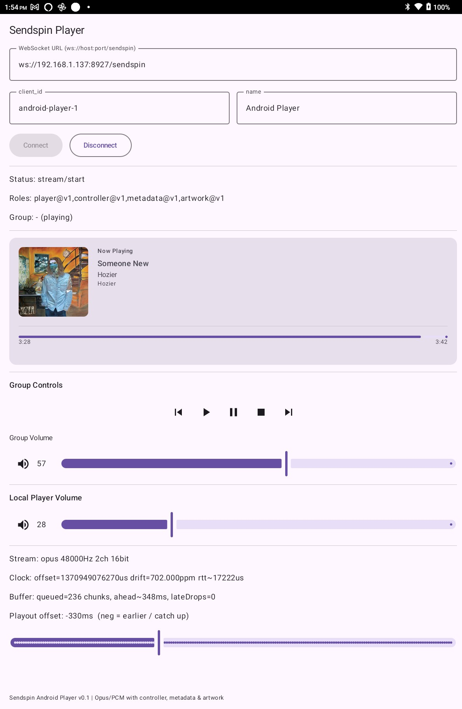

# Sendspin Android Player

An Android **Sendspin** client that acts as a synchronized network audio **player** and optional **controller**.
It connects to a Sendspin-compatible server over WebSocket, receives timestamped PCM or Opus audio frames,
performs clock synchronisation and jitter buffering, and plays audio in tight sync with other devices.



## Features

- **Synchronized audio playback**
  - Server–client clock alignment with drift estimation
  - Timestamp-based playout with adjustable real-time offset
- **Opus and PCM support**
  - PCM-only mode by default (optimized for local WiFi)
  - Opus support available via `enableOpusCodec` intent parameter
  - Opus decoding via Concentus (pure Java)
  - 16‑bit PCM output using Android `AudioTrack`
- **Adaptive jitter buffering**
  - Late-frame detection and dropping
  - Startup and restart catch-up logic to avoid buffer deadlock
- **Controller role support**
  - Play / pause / stop / next / previous
  - Group volume and mute
- **Metadata role support**
- **Artwork role support**
- **Modern Android UI**
  - Jetpack Compose UI
  - Live diagnostics: offset, drift, RTT, buffer depth
  - Real-time playout offset slider for sync tuning

## Architecture Overview

- **SendspinPcmClient**
  - WebSocket protocol handling
  - Audio stream lifecycle
  - Clock sync, playout scheduling, and control commands
- **ClockSync**
  - RTT-based offset estimation
  - Drift calculation (ppm)
- **AudioJitterBuffer**
  - Timestamp-ordered queue
  - Late-drop and restart recovery logic
- **OpusDecoder**
  - Concentus-based Opus → PCM decoding
- **PcmAudioOutput**
  - Low-level AudioTrack streaming
- **PlayerViewModel / MainActivity**
  - Compose UI state and controls

## Protocol Notes

- Binary audio frames:
  - Type `0x04`
  - 8‑byte **big-endian server timestamp** (µs)
  - Followed by Opus or PCM payload
- JSON messages handle:
  - Handshake (`client/hello`, `server/hello`)
  - Time sync (`client/time`, `server/time`)
  - Stream lifecycle (`stream/start`, `stream/end`)
  - Controller and group state

## Usage

1. Build and install the app on an Android device.
2. Enter the URL of your Sendspin server:
   ```
   ws://<host>:<port>/sendspin
   ```
3. Set a unique `client_id` and name.
4. Connect.
5. Adjust **Playout offset** if required to fine-tune sync with other Sendspin players.

### Intent Parameters

The app supports the following intent extras for programmatic configuration:

- **`playoutOffsetMs`** (Long, optional)
  - Sets the initial playout offset in milliseconds when the app starts
  - Negative values cause the player to catch up (play earlier)
  - Positive values delay playback (play later)
  - Range: -1000ms to +1000ms
  - **Persistence**: When provided via intent, this value overrides the saved offset. Any adjustments made via the UI slider are automatically saved and will be restored on the next app launch (unless overridden again by an intent parameter)
  - Example:
    ```bash
    adb shell am start -n com.sendspinlite/.MainActivity \
      --el playoutOffsetMs -50
    ```
    This starts the app with a 50ms catch-up offset (overriding any previously saved value).

- **`enableOpusCodec`** (Boolean, optional)
  - Enables Opus codec support for audio streaming
  - When `true`: Opus is offered as the preferred codec (with PCM as fallback)
  - When `false` (default): Only PCM is offered to the server
  - **Default**: `false` (PCM-only mode optimized for local WiFi)
  - **Use case**: Enable Opus when bandwidth is a concern; for local WiFi networks, PCM-only is recommended
  - **Persistence**: When provided via intent, this value overrides the saved setting and persists across app restarts
  - Example:
    ```bash
    adb shell am start -n com.sendspinlite/.MainActivity \
      --ez enableOpusCodec true
    ```
    This starts the app with Opus codec enabled.

  - Combined with playout offset:
    ```bash
    adb shell am start -n com.sendspinlite/.MainActivity \
      --el playoutOffsetMs 0 \
      --ez enableOpusCodec true
    ```

## Requirements

- Android API 26+
- Sendspin-compatible server (homeassistant)

## Status

This project is functional but still experimental.
The UI exposes internal timing and buffering stats to aid debugging and sync tuning.

Issues:
- When a group is playing, and the app is connected, it won't play audio until a track change is forced on music assistant (but I believe this is a server side bug which i've reported to HA)
- .... it hasn't had much testing!

This is vibe coded - so may have unintentional comments and/or code

---


