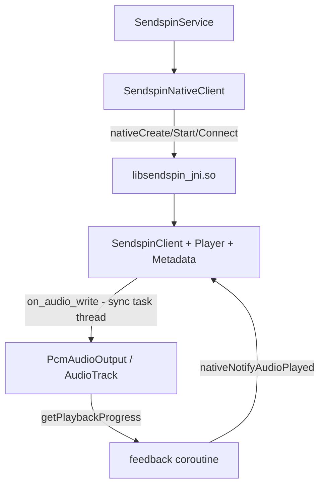

# Native Client (sendspin-cpp + JNI)

The SendSpin Android player runs the [sendspin-cpp](https://github.com/Sendspin/sendspin-cpp)
library for all protocol, time-synchronization and audio-scheduling work. Kotlin is a thin shell
that owns the Android foreground service, mDNS discovery, the Compose UI, the `AudioTrack` output
and diagnostics. This document covers how the native client is built and wired in.

## Building

The library is vendored as a git submodule pinned to a release tag, so initialise submodules
before building:

```bash
git submodule update --init --recursive
```

Install the native toolchain through the Android SDK manager (versions pinned in
[`app/build.gradle.kts`](../app/build.gradle.kts)):

- **NDK** `27.0.12077973` (with explicit 16 KB linker flags in CMake)
- **CMake** `3.22.1`

Then build as usual; Gradle's `externalNativeBuild` compiles the bridge automatically:

```bash
./gradlew assembleDebug
```

The native build produces `libsendspin_jni.so` for `arm64-v8a`, `armeabi-v7a` and `x86_64`. The
configure step uses CMake `FetchContent` to download ArduinoJson, micro-flac, micro-opus and
IXWebSocket, so network access is required on the first configure (and in CI).

### 16 KB page size (Android 15+)

Google Play requires 16 KB ELF alignment for native libraries on 64-bit devices targeting
Android 15+. NDK r28+ does this by default; with **NDK r27** this project passes explicit linker
flags in [`CMakeLists.txt`](../app/src/main/cpp/CMakeLists.txt):

```
-Wl,-z,max-page-size=16384
-Wl,-z,common-page-size=16384
```

After building, verify alignment with:

```bash
zipalign -c -P 16 -v 4 app/build/outputs/apk/debug/app-debug.apk
```

On a 16 KB test device or emulator, `adb shell getconf PAGE_SIZE` should return `16384`.

## Build layout

[`app/src/main/cpp/CMakeLists.txt`](../app/src/main/cpp/CMakeLists.txt) `add_subdirectory`s the
submodule with only the **player** and **metadata** roles enabled (all other roles, examples and
tests off) and links the resulting static `sendspin` library into `libsendspin_jni.so`. IXWebSocket
is built without TLS/zlib, matching the cleartext `ws://` transport.

| File | Responsibility |
|------|----------------|
| `jni_onload.cpp` | Captures the `JavaVM`; attaches/detaches native threads to the JVM. |
| `sendspin_client_handle.{h,cpp}` | Owns the `SendspinClient`, player + metadata roles, listeners and the main-loop thread; defines all JNI entry points. |
| `android_player_listener.cpp` | `PlayerRoleListener` → PCM writes and player events to Kotlin. |
| `android_metadata_listener.cpp` | `MetadataRoleListener` → track metadata to Kotlin. |
| `android_client_listener.cpp` | `SendspinClientListener` → group updates, time-sync error, high-performance requests. |
| `android_network_provider.cpp` | `SendspinNetworkProvider` → defers the network-ready check to Kotlin. |

On the Kotlin side, [`SendspinNative.kt`](../app/src/main/java/com/sendspinlite/client/SendspinNative.kt)
is the JNI loader and [`SendspinNativeClient.kt`](../app/src/main/java/com/sendspinlite/client/SendspinNativeClient.kt)
is the wrapper the service uses.

## Threading and audio flow



- A native **main-loop thread** (owned by `ClientHandle`) calls `client.loop()` every ~10 ms.
  All non-audio callbacks (metadata, group, volume/mute/static-delay, time-sync, high-performance,
  connection-state) fire on this thread.
- `on_audio_write` fires on sendspin-cpp's **sync task thread**. The bridge hands the native PCM
  buffer to Kotlin as a direct `ByteBuffer` (zero copy) and `PcmAudioOutput.writePcm` performs a
  bounded, partially-blocking `AudioTrack` write.
- A Kotlin **feedback coroutine** polls `PcmAudioOutput.getPlaybackProgress()` every ~5 ms and calls
  `notify_audio_played(frames, finishTimestampUs)`.

### Clock domain

sendspin-cpp's host time source is `std::chrono::steady_clock` (CLOCK_MONOTONIC). The progress
timestamp passed to `notify_audio_played` is therefore derived from `AudioTimestamp.nanoTime` /
`System.nanoTime()` (also CLOCK_MONOTONIC), **not** `SystemClock.elapsedRealtimeNanos()`
(CLOCK_BOOTTIME), so the two clocks are directly comparable.

### Native thread → JVM attachment

Native threads that call into Kotlin are attached lazily via `GetEnv()` and detached automatically
at thread exit by a `thread_local` guard in `jni_onload.cpp`. The Kotlin callbacks object is held as
a JNI global ref for the lifetime of the handle.

## Configuration

`nativeCreate` advertises a **PCM-only** player (48000/44100 Hz × 16/24/32-bit, stereo), a 2 MB audio
ring buffer. Pipeline delay is tracked via `notify_audio_played` feedback (not a fixed delay offset). The
static delay is applied via `update_static_delay` and is server-adjustable.

## Diagnostic differences vs. the old Kotlin client

The native sync task synchronizes differently from the previous Kotlin stack, so some diagnostics
changed:

- **Removed**: `playbackSpeedMultiplier` / sample-rate nudging — native sync uses silence
  insert/drop instead.
- **Defaulted / not yet surfaced**: `forceResyncActive`, `lateRestartLoops`, `audibleSyncCount`,
  `kalmanErrorCount`, `playbackRecoveryStatus`, `queuedChunks`, `bufferAheadMs`, `lateDrops` — these
  reflected Kotlin jitter-buffer internals that no longer exist and currently report defaults.
- **`offsetUncertaintyUs`** is sourced from the native time-sync error callback
  (`on_time_sync_updated`).
- **`smoothedLatencyMs`** comes from `PcmAudioOutput.getSmoothedLatencyMs()` (AudioTrack pipeline estimate).
- **`bufferAheadMs` / `queuedChunks`** reflect PCM queued in the AudioTrack output path (written − presented), not the old Kotlin jitter-buffer server-time ahead metric.

## Known integration notes

- `setPlayoutOffsetAdjustmentMs` is a no-op: sendspin-cpp exposes no runtime setter for the fixed
  pipeline delay; sync is driven by playback feedback instead of the old Kotlin playout offset.
- The low-memory `trimAudioBuffer*` callbacks are no-ops: the native ring buffer is fixed-size.
- WiFi high-performance: the service wires `onRequestHighPerformance` / `onReleaseHighPerformance`
  to acquire/release the `WifiManager.WifiLock`.
